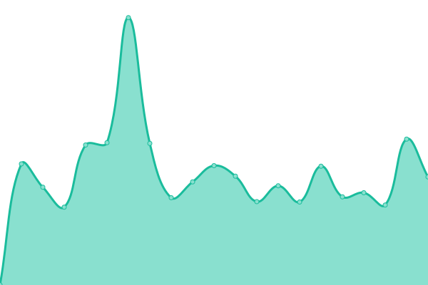
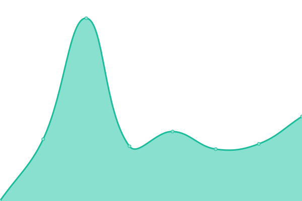
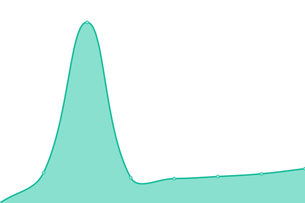
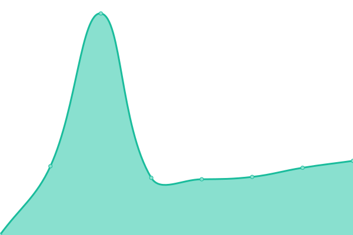

# [📈 Live Status](https://vkgroupoutsourcing.github.io/monitor): <!--live status--> **🟩 All systems operational**

This repository contains the open-source uptime monitor and status page for [VK Group Outsourcing](https://www.vkgroupoutsourcing.com), powered by [Upptime](https://github.com/upptime/upptime).

With [Upptime](https://upptime.js.org), you can get your own unlimited and free uptime monitor and status page, powered entirely by a GitHub repository. We use [Issues](https://github.com/vkgroupoutsourcing/monitor/issues) as incident reports, [Actions](https://github.com/vkgroupoutsourcing/monitor/actions) as uptime monitors, and [Pages](https://vkgroupoutsourcing.github.io/monitor) for the status page.

<!--start: status pages-->
<!-- This summary is generated by Upptime (https://github.com/upptime/upptime) -->
<!-- Do not edit this manually, your changes will be overwritten -->
<!-- prettier-ignore -->
| URL | Status | History | Response Time | Uptime |
| --- | ------ | ------- | ------------- | ------ |
|  [ga-espana](https://vkgroup.ga-espana.es) | 🟩 Up | [ga-espana.yml](https://github.com/vkgroupoutsourcing/monitor/commits/HEAD/history/ga-espana.yml) | 

 1114ms
     
 | 

<a href="https://vkgroupoutsourcing.github.io/monitor/history/ga-espana">100.00%</a>
    

|  [gacatalunya](https://vkgroup.gacatalunya.es) | 🟩 Up | [gacatalunya.yml](https://github.com/vkgroupoutsourcing/monitor/commits/HEAD/history/gacatalunya.yml) | 

 623ms
     
 | 

<a href="https://vkgroupoutsourcing.github.io/monitor/history/gacatalunya">100.00%</a>
    

|  [vk-andalucia](https://vkgroup.vk-andalucia.es) | 🟩 Up | [vk-andalucia.yml](https://github.com/vkgroupoutsourcing/monitor/commits/HEAD/history/vk-andalucia.yml) | 

 569ms
     
 | 

<a href="https://vkgroupoutsourcing.github.io/monitor/history/vk-andalucia">100.00%</a>
    

|  [vk-aragon](https://vkgroup.vk-aragon.es) | 🟩 Up | [vk-aragon.yml](https://github.com/vkgroupoutsourcing/monitor/commits/HEAD/history/vk-aragon.yml) | 

 556ms
     
 | 

<a href="https://vkgroupoutsourcing.github.io/monitor/history/vk-aragon">100.00%</a>
    

|  [vk-castillalamancha](https://vkgroup.vk-castillalamancha.es) | 🟩 Up | [vk-castillalamancha.yml](https://github.com/vkgroupoutsourcing/monitor/commits/HEAD/history/vk-castillalamancha.yml) | 

 561ms
     
 | 

<a href="https://vkgroupoutsourcing.github.io/monitor/history/vk-castillalamancha">100.00%</a>
    

|  [vk-catalunya](https://vkgroup.vk-catalunya.es) | 🟩 Up | [vk-catalunya.yml](https://github.com/vkgroupoutsourcing/monitor/commits/HEAD/history/vk-catalunya.yml) | 

 611ms
     
 | 

<a href="https://vkgroupoutsourcing.github.io/monitor/history/vk-catalunya">100.00%</a>
    

|  [vkmproyectos](https://vkgroup.vkmproyectos.es) | 🟩 Up | [vkmproyectos.yml](https://github.com/vkgroupoutsourcing/monitor/commits/HEAD/history/vkmproyectos.yml) | 

 594ms
     
 | 

<a href="https://vkgroupoutsourcing.github.io/monitor/history/vkmproyectos">99.26%</a>
    

|  [vk-islasbaleares](https://vkgroup.vk-islasbaleares.es) | 🟩 Up | [vk-islasbaleares.yml](https://github.com/vkgroupoutsourcing/monitor/commits/HEAD/history/vk-islasbaleares.yml) | 

 542ms
     
 | 

<a href="https://vkgroupoutsourcing.github.io/monitor/history/vk-islasbaleares">100.00%</a>
    

|  [vk-islascanarias](https://vkgroup.vk-islascanarias.es) | 🟩 Up | [vk-islascanarias.yml](https://github.com/vkgroupoutsourcing/monitor/commits/HEAD/history/vk-islascanarias.yml) | 

 565ms
     
 | 

<a href="https://vkgroupoutsourcing.github.io/monitor/history/vk-islascanarias">100.00%</a>
    

|  [vk-madrid](https://vkgroup.vk-madrid.es) | 🟩 Up | [vk-madrid.yml](https://github.com/vkgroupoutsourcing/monitor/commits/HEAD/history/vk-madrid.yml) | 

 484ms
     
 | 

<a href="https://vkgroupoutsourcing.github.io/monitor/history/vk-madrid">100.00%</a>
    

|  [vk-murcia](https://vkgroup.vk-murcia.es) | 🟩 Up | [vk-murcia.yml](https://github.com/vkgroupoutsourcing/monitor/commits/HEAD/history/vk-murcia.yml) | 

 513ms
     
 | 

<a href="https://vkgroupoutsourcing.github.io/monitor/history/vk-murcia">100.00%</a>
    

|  [vk-nacional](https://vkgroup.vk-nacional.es) | 🟩 Up | [vk-nacional.yml](https://github.com/vkgroupoutsourcing/monitor/commits/HEAD/history/vk-nacional.yml) | 

 513ms
     
 | 

<a href="https://vkgroupoutsourcing.github.io/monitor/history/vk-nacional">100.00%</a>
    

|  [vk-valencia](https://vkgroup.vk-valencia.es) | 🟩 Up | [vk-valencia.yml](https://github.com/vkgroupoutsourcing/monitor/commits/HEAD/history/vk-valencia.yml) | 

 522ms
     
 | 

<a href="https://vkgroupoutsourcing.github.io/monitor/history/vk-valencia">100.00%</a>
    

|  [vklcatalunya](https://vkgroup.vklcatalunya.es) | 🟩 Up | [vklcatalunya.yml](https://github.com/vkgroupoutsourcing/monitor/commits/HEAD/history/vklcatalunya.yml) | 

 530ms
     
 | 

<a href="https://vkgroupoutsourcing.github.io/monitor/history/vklcatalunya">100.00%</a>
    

|  [vklmadrid](https://vkgroup.vklmadrid.es) | 🟩 Up | [vklmadrid.yml](https://github.com/vkgroupoutsourcing/monitor/commits/HEAD/history/vklmadrid.yml) | 

 511ms
     
 | 

<a href="https://vkgroupoutsourcing.github.io/monitor/history/vklmadrid">100.00%</a>
    

|  [vkmcatalunya](https://vkgroup.vkmcatalunya.es) | 🟩 Up | [vkmcatalunya.yml](https://github.com/vkgroupoutsourcing/monitor/commits/HEAD/history/vkmcatalunya.yml) | 

 531ms
     
 | 

<a href="https://vkgroupoutsourcing.github.io/monitor/history/vkmcatalunya">100.00%</a>
    

|  [vkmmadrid](https://vkgroup.vkmmadrid.es) | 🟩 Up | [vkmmadrid.yml](https://github.com/vkgroupoutsourcing/monitor/commits/HEAD/history/vkmmadrid.yml) | 

 493ms
     
 | 

<a href="https://vkgroupoutsourcing.github.io/monitor/history/vkmmadrid">100.00%</a>
    

<!--end: status pages-->

[**Visit our status website →**](https://vkgroupoutsourcing.github.io/monitor)

## 📄 License

- Powered by: [Upptime](https://github.com/upptime/upptime)
- Code: [MIT](./LICENSE) © [Anand Chowdhary](https://anandchowdhary.com), supported by [Pabio](https://pabio.com)
- Data in the `./history` directory: [Open Database License](https://opendatacommons.org/licenses/odbl/1-0/)
